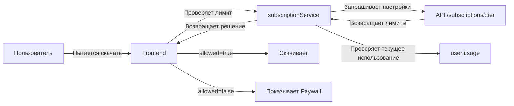

# ✅ Система подписок развернута и готова!

## 🎉 Что сделано

### 1. Backend (Сервер) ✅
- ✅ Модель `Subscription` с гибкими настройками
- ✅ Модель `User` обновлена (убран enum для динамических тарифов)
- ✅ CRUD API для админа:
  - `POST /api/admin/subscriptions` - создание
  - `GET /api/admin/subscriptions` - список
  - `GET /api/admin/subscriptions/:tier` - получение
  - `PUT /api/admin/subscriptions/:tier` - обновление
  - `DELETE /api/admin/subscriptions/:tier` - удаление
- ✅ Публичное API для фронтенда:
  - `GET /api/subscriptions` - все активные
  - `GET /api/subscriptions/:tier` - конкретная подписка
- ✅ Защита от удаления используемых тарифов
- ✅ Поддержка безлимита (-1)

### 2. Frontend (Клиент) ✅
- ✅ `subscriptionService` - сервис для проверки лимитов:
  - `canDownloadOffline(user, 'books')`
  - `canAddToFavorites(user, 'nashids')`
  - `canAccessContent(user, 'premium')`
  - `hasFeature(user, 'adFree')`
  - `getLimitsSummary(user)`
- ✅ Кэширование настроек (5 минут)
- ✅ Автоматическая очистка кэша

### 3. Админ-панель ✅
- ✅ Страница управления подписками
- ✅ Кнопка "Создать подписку"
- ✅ Модальное окно создания с полными настройками
- ✅ Редактирование всех параметров
- ✅ Удаление подписок
- ✅ Визуальная обратная связь

### 4. База данных ✅
- ✅ Создано 3 дефолтные подписки:
  - **Muslim** (Free): 3/10 книг, 5/15 нашидов
  - **Mutahsin** (Pro): 20/50 книг, 30/100 нашидов, без рекламы
  - **Sahib** (Premium): безлимит всего, все функции

## 🔗 Ссылки

### Продакшен
- **Админ-панель**: https://mubarak-way.onrender.com/admin/subscriptions
- **API (публичное)**: https://mubarakway-backend.onrender.com/api/subscriptions
- **API (админ)**: https://mubarakway-backend.onrender.com/api/admin/subscriptions

### Учётные данные
- **Username**: `admin`
- **Password**: `admin123`

## 📚 Документация

### Основные документы:
1. **SUBSCRIPTION_SYSTEM.md** - полное описание системы, модели, API
2. **SUBSCRIPTION_USAGE.md** - примеры использования на фронтенде
3. **SUBSCRIPTION_QUICK_START.md** - быстрый старт для интеграции

### Где искать:
- Модели: `server/models/Subscription.js`, `server/models/User.js`
- API: `server/routes/subscriptions.js`, `server/routes/admin.js`
- Сервис: `src/services/subscriptionService.js`
- Админка: `src/pages/admin/AdminSubscriptions.jsx`

## 🎯 Следующие шаги

### Приоритет 1: Интеграция в UI
Добавить проверки лимитов в:

1. **Library (Библиотека)**
   ```javascript
   // src/pages/Library.jsx
   const handleDownloadBook = async (book) => {
     const check = await subscriptionService.canDownloadOffline(user, 'books');
     if (!check.allowed) {
       showLimitReached(check.reason);
       return;
     }
     // Скачиваем...
   };
   ```

2. **Nashids (Нашиды)**
   ```javascript
   // src/pages/Nashids.jsx
   const handleDownloadNashid = async (nashid) => {
     const check = await subscriptionService.canDownloadOffline(user, 'nashids');
     if (!check.allowed) {
       showUpgradePrompt();
       return;
     }
     // Скачиваем...
   };
   ```

3. **BookReader (Чтение книг)**
   ```javascript
   // src/components/EnhancedBookReader.jsx
   useEffect(() => {
     checkAccess();
   }, [book]);

   const checkAccess = async () => {
     const check = await subscriptionService.canAccessContent(user, book.accessLevel);
     if (!check.allowed) {
       setShowPaywall(true);
     }
   };
   ```

### Приоритет 2: UI/UX
4. **Profile (Профиль)**
   - Показывать текущую подписку
   - Отображать лимиты с прогресс-барами
   - Кнопка "Улучшить подписку"

5. **Upgrade Modal (Модалка апгрейда)**
   - Сравнение тарифов
   - Преимущества Pro/Premium
   - Кнопка оплаты

### Приоритет 3: Аналитика
6. **Dashboard (Дашборд админа)**
   - Добавить статистику по подпискам
   - Количество пользователей на каждом тарифе
   - Конверсия free → paid

## 🧪 Тестирование

### Как протестировать:

1. **Откройте админку**:
   - https://mubarak-way.onrender.com/admin/subscriptions

2. **Попробуйте создать подписку**:
   - Нажмите "Создать подписку"
   - Заполните данные (например, tier: `vip`)
   - Сохраните

3. **Отредактируйте лимиты**:
   - Нажмите на карандаш у любой подписки
   - Измените лимит (например, книги: -1 для безлимита)
   - Сохраните

4. **Проверьте API**:
   ```bash
   curl https://mubarakway-backend.onrender.com/api/subscriptions
   ```

5. **Протестируйте сервис** (в консоли браузера):
   ```javascript
   import subscriptionService from './services/subscriptionService';

   // Получить пользователя из Redux
   const user = store.getState().auth.user;

   // Проверить лимит
   const check = await subscriptionService.canDownloadOffline(user, 'books');
   console.log(check); // { allowed: true/false, reason: "...", current: X, limit: Y }
   ```

## 🎨 Возможности для пользователей

### Muslim (Бесплатно)
- ✅ 3 книги офлайн
- ✅ 10 избранных книг
- ✅ 5 нашидов офлайн
- ✅ 15 избранных нашидов
- ✅ Офлайн режим
- ✅ Доступ к бесплатному контенту

### Mutahsin (Pro) - 299₽/месяц
- ✅ 20 книг офлайн
- ✅ 50 избранных книг
- ✅ 30 нашидов офлайн
- ✅ 100 избранных нашидов
- ✅ Офлайн режим
- ✅ Без рекламы
- ✅ Ранний доступ
- ✅ Доступ к Free + Pro контенту

### Sahib (Premium) - 599₽/месяц
- ✅ Безлимит всего
- ✅ Офлайн режим
- ✅ Без рекламы
- ✅ Приоритетная поддержка
- ✅ Ранний доступ
- ✅ Доступ ко всему контенту (Free + Pro + Premium)

## 🔧 Управление

### Создание кастомной подписки:
1. Откройте админку → Подписки
2. Нажмите "Создать подписку"
3. Введите:
   - **Tier ID**: `business` (только lowercase!)
   - **Название**: `Business (Для компаний)`
   - **Описание**: `Корпоративная подписка`
   - **Цена**: `9999 RUB / yearly`
   - **Лимиты**: -1 для безлимита
   - **Доступ**: все галочки
   - **Возможности**: все галочки
4. Сохраните

### Редактирование:
1. Нажмите на карандаш
2. Измените нужные поля
3. Нажмите "Сохранить изменения"

### Удаление:
1. Нажмите на корзину
2. Подтвердите удаление
3. ⚠️ Нельзя удалить, если есть пользователи на этом тарифе

## 📊 Как это работает



## ✨ Готово к использованию!

Все работает на продакшене. Осталось только интегрировать проверки в UI компоненты по примерам из документации.

**Удачи! 🚀**
